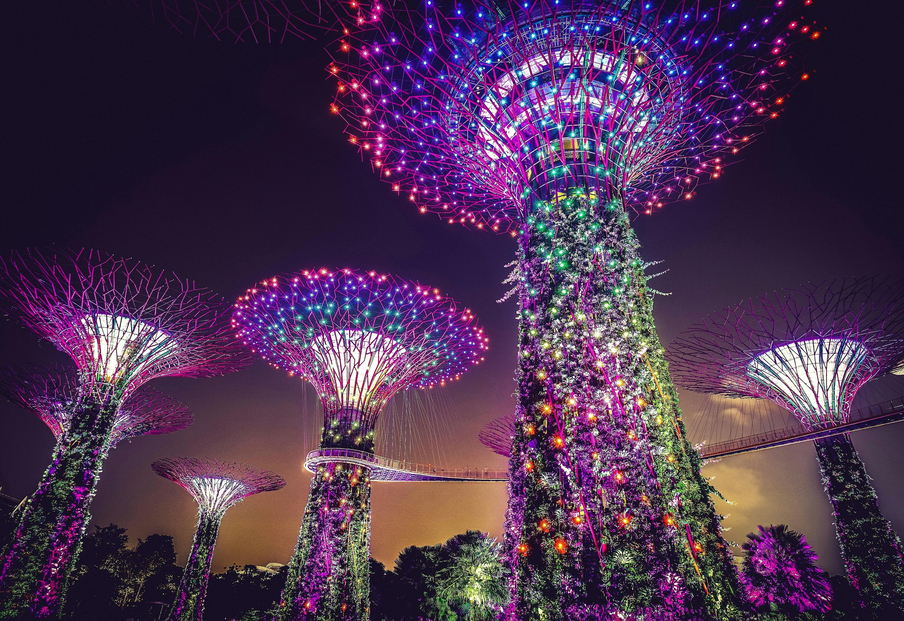

<!-- README.md -->

<h1 align="center">Hi 👋, I'm Kevin Naidoo</h1>
<h3 align="center">Born to solve problems, forced to do it someone else's way.</h3>

  

---

### 🧠 About Me
- 🔭 I’m constantly building, breaking and refining.
- 🧩 Problems are puzzles; I'm addicted to solving them.
- 🎯 Focused on meaningful outcomes, not just lines of code.
- 🧘‍♂️ Calm under pressure, deadly with a keyboard.

---

### 📊 GitHub Stats

  
  

  

---

### 🏆 GitHub Trophies

  

---

### 🔮 Random Dev Quote

  

---

### 📈 Profile Visitors

  

---

🧰 Developer Toolbox

  

---

> “The best code is no code at all – but that doesn't mean I won't write great code when I have to.”  
> <em>– Kevin Naidoo</em>

